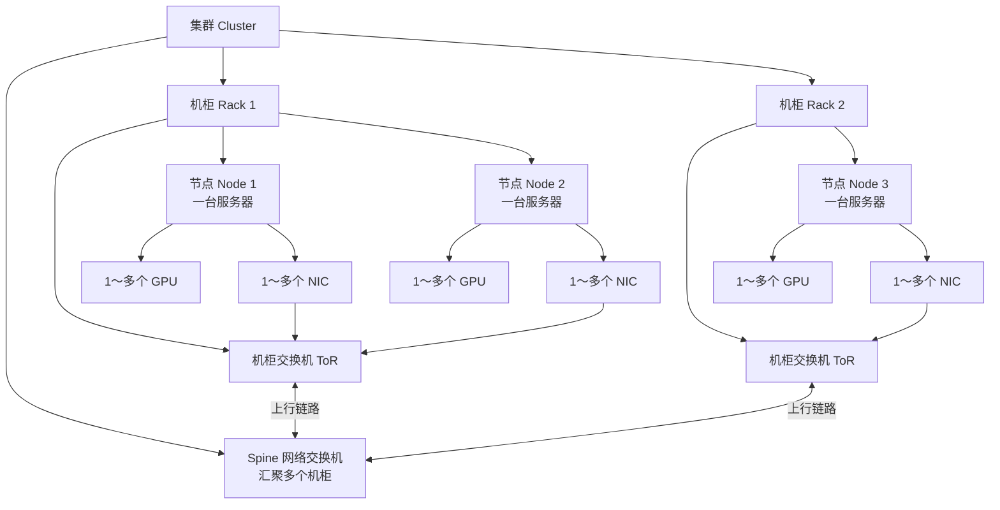
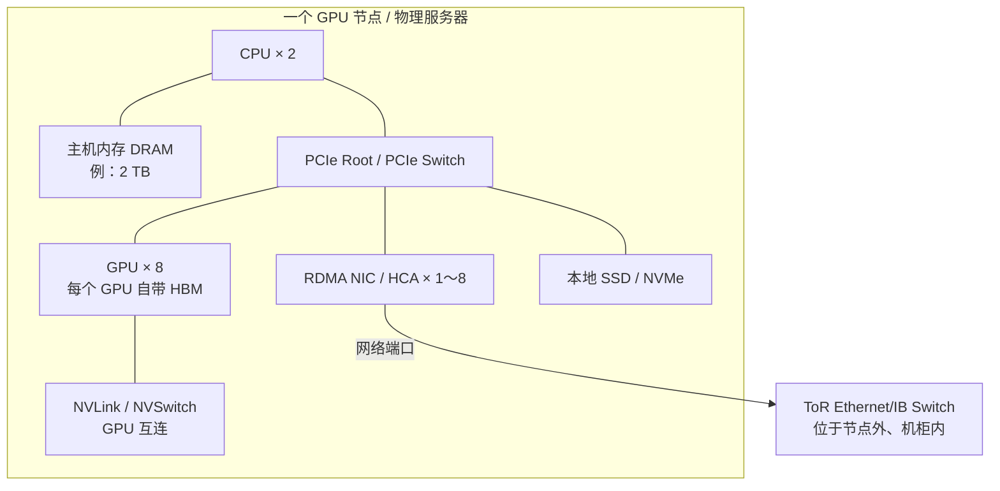
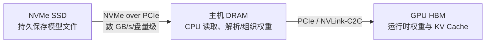
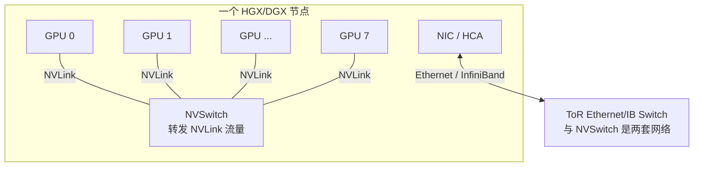
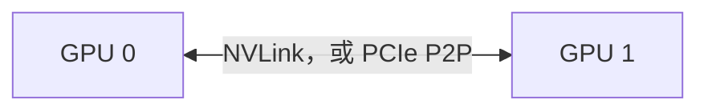
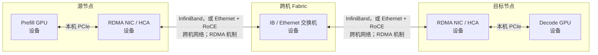
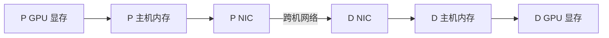
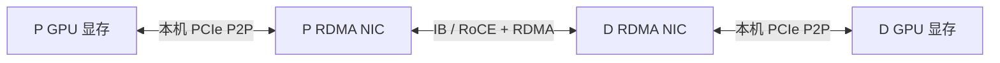
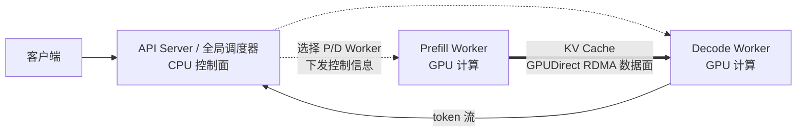

# GPU 集群硬件与 RDMA 网络层级

> 导航：[00 基础知识地图](<./00 索引：LLM推理基础设施知识地图.md>)

> 先分清四层：**GPU、NIC 和交换机是设备，PCIe/NVLink 主要是本机互连，InfiniBand/Ethernet 是跨机网络，RDMA 是通信机制。**它们会组成一条数据路径，但不是同一层概念。

## 1. 卡、节点、机柜和集群



```text
集群
├── Spine 交换机：汇聚多个机柜
└── 多个机柜
    ├── ToR / Leaf 交换机：连接本机柜节点，并上联 Spine
    └── 多个节点（服务器）
        ├── CPU 和主机内存
        ├── 一个或多个 GPU
        └── 一个或多个 NIC
```

展开一台典型 GPU 节点（数量只是示例）：

```text
节点 Node / 一台物理服务器
├── 2 个 CPU
├── 2 TB 主机内存（DRAM）
├── 8 个 GPU
│   └── 每个 GPU 有自己的显存（HBM）
├── 1～8 个 RDMA NIC / HCA
├── 本地 SSD / NVMe
└── 节点内互连
    ├── PCIe：连接 CPU、GPU、NIC、NVMe
    └── NVLink / NVSwitch：高速连接 GPU
```



- **主机内存（DRAM）**属于 CPU 主机地址空间，与 GPU 上的显存（HBM）不是同一层存储。
- **本地 SSD/NVMe**用于操作系统、模型权重、缓存或临时数据；模型运行时的权重和 KV Cache 通常主要在 GPU HBM 中。
- **NIC 数量不必等于 GPU 数量**；`8 GPU + 8 NIC` 是高带宽配置示例，不是所有节点的固定规格。

> **SSD 是设备，NVMe 是协议。**SSD 还可以使用 SATA/SAS；日常说“NVMe 盘”，通常指通过 PCIe 使用 NVMe 协议的 SSD。`M.2`、`U.2`、`EDSFF` 等主要是外形/接口形态，不等于 NVMe 协议本身。

- **节点（Node）**：在 GPU 集群中通常指一台物理服务器。
- **GPU 卡**：安装在节点内；一个节点通常有多个 GPU。
- **NIC（Network Interface Card）**：网卡的统称，通常安装在节点内；普通 NIC 不一定支持 RDMA。
- **RNIC（RDMA-capable NIC）**：支持 RDMA 的网卡；RoCE RNIC 同时也是 Ethernet NIC。
- **HCA（Host Channel Adapter）**：InfiniBand 主机适配器的常用名称，支持 RDMA。
- **ToR（Top-of-Rack）/ Leaf 交换机**：向下连接本机柜各节点的 NIC，向上连接 Spine。
- **Spine 交换机**：汇聚多个 ToR/Leaf，让不同机柜的节点通信。

GPU 通常不自带一个独立网卡。但为了带宽和拓扑亲和性，高性能节点可能按 `1 NIC : 1 GPU` 或 `1 NIC : 2 GPU` 配置多张 NIC；这些 NIC 仍然属于节点。

NIC 数量的意义主要是：

- **总带宽**：多个 NIC/端口可形成多 rail 并行通信。
- **GPU–NIC 亲和性**：让 GPU 使用同一 PCIe root complex 下距离较近的 NIC，减少跨 CPU socket / PCIe 转发。
- **网络分工**：计算 Fabric、存储网络、业务网络和管理网络可使用不同 NIC。
- **冗余**：单个 NIC、端口或链路故障时仍有备用路径。

> NIC 多不代表应用一定线性变快：还受 PCIe 拓扑、交换机上行带宽、网络拥塞、通信库和负载均衡影响。一张 NIC 也可能有多个网络端口，因此“NIC 数”和“端口数”不一定相同。

NIC/HCA 到交换机之间还有物理层：可以使用 DAC/ACC 铜缆、AOC，或“光模块 + 光纤”。RDMA 不规定必须使用哪种介质，详见 [GPU 集群网络物理层：NIC、光模块与线缆](<./00 GPU集群网络物理层：NIC、光模块与线缆.md>)。

## 2. 设备、链路、网络和机制

| 层次 | 概念 | 作用 |
| --- | --- | --- |
| **设备** | GPU | 执行模型计算，在显存中保存 KV Cache |
| **设备** | NIC / RNIC / HCA | NIC 是网卡统称；RNIC/HCA 具备 RDMA 能力 |
| **设备** | PCIe Switch | 在节点内转发 PCIe 事务 |
| **设备** | NVSwitch | 在 NVLink Fabric 中转发 GPU 数据 |
| **设备** | Ethernet / IB Switch | 通过 NIC/HCA 连接节点和机柜 |
| **本机互连** | PCIe | 连接同一节点内的 CPU、GPU、NIC 等设备 |
| **GPU 互连** | NVLink | 高带宽 GPU 互连；传统系统多在节点内，NVL72 可扩展到机架级 |
| **跨机网络** | InfiniBand | 原生支持 RDMA 的高性能网络 Fabric |
| **跨机网络** | Ethernet | 通用以太网；可以承载 TCP 或 RoCE |
| **网络协议** | RoCE | RDMA over Converged Ethernet，在以太网上承载 RDMA |
| **通信机制** | DMA | 设备直接读写内存，CPU 不用逐字节搬运 |
| **通信机制** | RDMA | 通过 RNIC/HCA 在远端已注册内存之间低开销传输；也支持 Send/Receive 语义 |
| **通信机制** | GPUDirect RDMA | 让 RNIC/HCA 直接 DMA 读写 GPU 显存，避免 CPU 主存中转 |

> **RDMA 不是一张卡、一根线或一种物理介质。**RNIC/HCA 是设备，IB 或 Ethernet+RoCE 是跨机网络，RDMA 是设备、驱动、协议栈和通信库共同实现的通信机制。

### 三组容易混淆的关系

```text
NIC ⊃ 支持 RDMA 的 NIC（RNIC）
HCA ≈ InfiniBand 场景中的 RDMA 主机适配器
```

有 RDMA 能力不等于所有流量都走 RDMA。以 RoCE RNIC 为例，同一张卡可以承载普通 TCP/IP，也可以由 NCCL、UCX、libfabric 或 verbs 等软件路径使用 RDMA。

```text
DMA              设备直接访问本机内存
RDMA             RNIC/HCA 访问远端节点的已注册内存
GPUDirect RDMA   RNIC/HCA 可直接 DMA 读写 GPU 显存，省去主机内存中转
```

GPUDirect RDMA 不是“GPU 绕过网络直接访问远端 GPU”：数据仍要经过本机设备互连、两端 RNIC/HCA 和 IB/RoCE 网络；它主要绕过的是 CPU 主存 bounce buffer。

```text
同节点 GPU 通信   NVLink / NVSwitch / PCIe P2P
跨节点 GPU 通信   RNIC/HCA + InfiniBand，或 RNIC + Ethernet/RoCE
```

同节点通常不称为 RDMA 场景；跨节点才是 RDMA 的主要使用范围。通信库会根据拓扑组合这些路径，例如同节点走 NVLink、跨节点走 GPUDirect RDMA。

## 3. 存储容量和互连带宽的粗略量级

> 下表只用来建立数量级直觉。实际数值受硬件代际、数量、方向、端口数和并发度影响，不能将厂商标注峰值直接当成应用实测速度。

### 存储层级

| 层级 | 常见容量量级 | 带宽量级 | 是否持久化 | 主要用途 |
| --- | --- | --- | --- | --- |
| **本地 NVMe SSD** | TB，单盘常为数 TB～数十 TB | 单盘数 GB/s | 是 | 模型文件、系统、数据和本地缓存 |
| **主机 DRAM** | 数百 GB～数 TB/节点 | 数百 GB/s/节点 | 否 | CPU 工作内存、请求与调度状态 |
| **GPU HBM** | 数十～数百 GB/GPU | 数 TB/s/GPU | 否 | 运行时权重、激活和 KV Cache |

以 H100 SXM 为具体参考：单 GPU 有 80 GB HBM、约 3.35 TB/s 显存带宽。这是一个产品示例，不是所有 GPU 的固定规格。

H100/H200/B200 等型号与 Hopper/Blackwell 架构、原生低精度格式和 AWQ/GPTQ 软件量化的关系，见 [NVIDIA GPU 架构、芯片与量化格式速查](<./00 NVIDIA GPU架构、芯片与量化格式速查.md>)。

### 模型加载的常见简化路径



```text
SSD 上的 model.safetensors
  → 读入主机 DRAM
  → 复制/分片到各 GPU HBM
  → GPU 执行推理
```

这是常见逻辑路径；GPUDirect Storage、memory mapping、分片并行加载等方案可以减少中转或额外拷贝。模型加载完成后，每次推理不会重新从 SSD 读取全部权重。

### 互连带宽

| 互连 | 作用范围 | 理论/标称带宽示例 |
| --- | --- | --- |
| **PCIe Gen4 x16** | 节点内 GPU/NIC 等设备 | 约 32 GB/s，单向 |
| **PCIe Gen5 x16** | 节点内 GPU/NIC 等设备 | 约 64 GB/s，单向 |
| **200 / 400 / 800 Gb/s NIC 端口** | 跨节点 IB/Ethernet | 分别约 25 / 50 / 100 GB/s 线速 |
| **H100 NVLink** | GPU–GPU | 单 GPU 总双向标称带宽 900 GB/s |
| **H100 HBM** | GPU 内部显存 | 约 3.35 TB/s；它是内存带宽，不是网络链路 |

> `Gb/s` 是千兆**位**/秒，`GB/s` 是千兆**字节**/秒，理论上 `8 bit = 1 byte`，所以 `400 Gb/s ÷ 8 ≈ 50 GB/s`。对比数字前还要确认它是单向、双向总和，还是多链路聚合值。

## 4. “交换机”不只有一种

```text
PCIe Switch       转发 PCIe 事务       常在节点内
NVSwitch          转发 NVLink 数据     在节点内或机架级系统中
ToR/Leaf Switch   转发 Ethernet/IB 数据 在机柜中，连接各节点 NIC
Spine Switch      转发 Ethernet/IB 数据 汇聚多个机柜
```

### 传统 HGX/DGX：NVSwitch 在节点内



例如 HGX/DGX H100 的 GPU baseboard 包含 8 个 H100 和 4 个 NVSwitch。NVSwitch 让本节点 GPU 通过 NVLink 高带宽互访，它不是 RDMA 路径中的 ToR 网络交换机。

### GB200/GB300 NVL72：NVSwitch 扩展到机架级

NVL72 是“72 个 GPU 组成一个机架级 NVLink 域”的系统形态，不是 GPU 型号。GB200、GB300 和 Vera Rubin 都有 NVL72 形态；它属于 NVIDIA 顶级 scale-up 路线，但高成本、高功耗、液冷和整柜运维使它还不是普通 GPU 集群的通用配置。详见 [NVL72：机架级 NVLink 系统](<./00 NVL72：机架级NVLink系统.md>)。

> **NVSwitch ≠ ToR/Spine 网络交换机。**它们都叫 switch，但连接对象、协议和作用范围不同。

## 5. 同节点与跨节点 GPU 传输

### 同节点



两个 GPU 在同一节点时，通常使用 CUDA P2P，底层根据硬件拓扑走 NVLink 或 PCIe。这条路径不经过跨机 NIC/交换机，通常不称为 RDMA。

### 跨节点

> **IB/RoCE 和 GPUDirect RDMA 不是二选一。**IB 或 Ethernet+RoCE 是节点间网络；GPUDirect RDMA 是 RNIC/HCA 通过该网络直接读写 GPU 显存的机制。同机架的不同普通节点和跨机架节点都可以使用 IB/RoCE。



在常见 x86 GPU 服务器中，完整路径是：

```text
源 GPU 显存
  → 源节点内 PCIe
  → 源 RDMA NIC
  → InfiniBand 或 RoCE 网络
  → 目标 RDMA NIC
  → 目标节点内 PCIe
  → 目标 GPU 显存
```

PCIe 通常是**节点内总线**，普通 GPU 集群中没有“跨节点 PCIe”。跨节点路径实际上是：

```text
本机 PCIe + 跨机网络 + 本机 PCIe
```

新型集成系统可能存在 NVLink-C2C、集成 NIC/DPU 或其他特殊路径，因此“跨机必然走 PCIe”不是对所有硬件的绝对结论；但上图是常见独立 GPU + ConnectX/HCA 服务器的典型路径。

## 6. GPUDirect RDMA 的“直接”绕过了什么

### 没有 GPUDirect RDMA：主机内存中转



### GPUDirect RDMA：NIC 直接访问 GPU 显存



GPUDirect RDMA 中的“直接”是指 **NIC 可以直接 DMA 读写 GPU 显存，不需要用 CPU 主存作 bounce buffer**。它没有绕过 NIC、跨机网络或本机设备互连，也不表示 CPU 完全不参与：CPU 仍可负责注册内存、建立连接、提交传输请求和处理完成事件，只是不再逐块中转数据。

NVIDIA 对 GPUDirect RDMA 的定义也是：利用 PCIe 的标准能力，在 GPU 和网卡等第三方设备之间建立直接数据路径。GPU 与 NIC 的 PCIe 拓扑会影响性能，同一 PCIe root complex / 交换树下通常更理想。

## 7. 放回 PD 分离语境



- **控制面**：CPU 上的路由器/调度器选择 P/D Worker，管理请求 ID、KV 位置和传输状态。
- **数据面**：GPU、RNIC/HCA、PCIe 和 IB/RoCE 网络实际搬运 KV Cache。
- **Worker 不等于一张 GPU**：一个 Worker 可以使用一张 GPU，也可以通过 Tensor Parallel 使用多张 GPU。
- **PD 分离不保证一定使用 RDMA**：TCP 或主机内存中转也可以实现功能，但传输大块 KV Cache 时通常性能较差。

## NVIDIA 官方资料

- [NVIDIA GPUDirect RDMA 完整文档](https://docs.nvidia.com/cuda/gpudirect-rdma/)：原理、PCIe 拓扑限制、GPU memory pinning 与 peer-memory API。
- [NVIDIA GPU Operator：GPUDirect RDMA](https://docs.nvidia.com/datacenter/cloud-native/gpu-operator/latest/gpu-operator-rdma.html)：在 Kubernetes / GPU Operator 环境中配置 GPUDirect RDMA。
- [NVIDIA Dynamo：RDMA Setup](https://docs.nvidia.com/dynamo/dev/kubernetes/installation/rdma-setup/overview)：PD 分离服务中传输 KV Cache 的 RDMA 路径和部署说明。
- [NVIDIA Fabric Manager：NVSwitch-Based Systems](https://docs.nvidia.com/hgx-platforms/fabric-manager-user-guide/index.html)：HGX/DGX A100、H100 和 B200/B300 的 GPU baseboard 与 NVSwitch 拓扑。
- [NVIDIA DGX GB Rack Scale Systems：Hardware](https://docs.nvidia.com/dgx/dgxgb200-user-guide/hardware.html)：NVL72 的 compute tray、NVLink switch tray 和 ToR 交换机层级。
- [NVM Express：NVMe over PCIe Transport](https://nvmexpress.org/specification/nvme-over-pcie-transport-specification/)：NVMe 如何通过 PCIe 与 SSD 通信。
- [PCI-SIG：PCIe Speeds and Feeds](https://pcisig.com/sites/default/files/files/PCIe_Specification_Webinar_Rev%206_FINAL_0.pdf)：各代 PCIe 的 x16 单向带宽。
- [NVIDIA H100 规格](https://www.nvidia.com/en-us/data-center/h100/)：HBM 容量/带宽、NVLink 和 PCIe 带宽示例。
