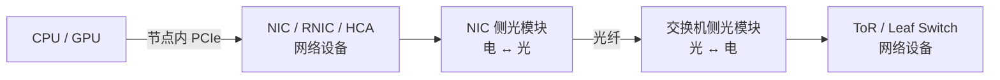

# GPU 集群网络物理层：NIC、光模块与线缆

> 导航：[00 基础知识地图](<./00 索引：LLM推理基础设施知识地图.md>)

> **NIC/RNIC/HCA 是网络设备，光模块负责光电转换，光纤/铜缆是传输介质。**普通 NIC 不一定支持 RDMA；支持 RDMA 的网卡才称 RNIC，InfiniBand 适配器通常称 HCA。

先把容易混淆的对象放到同一条链路上：

```text
服务器里的 GPU/CPU
  → PCIe
  → NIC / RNIC / HCA          网络设备
  → DAC/AOC，或光模块 + 光纤   物理连接
  → Ethernet / IB 交换机       网络设备
```

NIC 决定主机如何接入网络，光模块只负责端口侧的光电转换，线缆只负责传输信号。光模块既不是网卡，也不执行 RDMA。

## NIC 到交换机之间有什么



光模块通常插在 NIC/HCA 和交换机的 OSFP、QSFP112、QSFP-DD 等高速端口中。它把 NIC 的电信号变成光信号，在对端再转回电信号。

## 不一定使用可插拔光模块

```text
很近：NIC ═══ DAC 铜缆 ═══ 交换机
较近：NIC ═══ ACC/AEC 有源铜缆 ═══ 交换机
中等：NIC ═══ AOC 一体式光缆 ═══ 交换机
较远：NIC → 光模块 → 光纤 → 光模块 → 交换机
```

| 方案 | 介质 | 模块与线缆 | 常见用途 |
| --- | --- | --- | --- |
| **DAC** | 铜 | 连接头与铜缆一体 | 机柜内短距离，低成本、低功耗 |
| **ACC/LACC/AEC** | 铜 | 两端有信号增强电路 | 比 DAC 稍长的铜缆路径 |
| **AOC** | 光纤 | 光电转换器与光纤固定一体 | 中短距离、即插即用 |
| **光模块 + 光纤** | 多模/单模光纤 | 模块与光纤可分离 | 较长距离和结构化布线 |

NVIDIA 的当前高速网络产品同时支持 DAC、ACC/LACC、AOC 和可插拔光模块。距离越远，通常越需要光传输；但具体选择还受速率、功耗、散热、成本和布线影响。

## NIC 不一定支持 RDMA

```text
NIC              网卡的统称
├── 普通 NIC      主要承载 TCP/UDP 等常规网络流量
└── RDMA NIC      即 RNIC，硬件和驱动支持 RDMA

HCA              InfiniBand 主机适配器的常用名称，支持 RDMA
```

RoCE RNIC 本质上仍是 Ethernet NIC，通常既能走普通 TCP/IP，也能走 RoCE/RDMA；具体使用哪条路径取决于驱动、通信库和网络配置。机器装有 RDMA 网卡，不代表所有流量会自动变成 RDMA。

## RDMA 通常用于节点之间

```text
同一节点内 GPU ↔ GPU：NVLink / NVSwitch / PCIe P2P
不同节点间 GPU ↔ GPU：本机 PCIe + RNIC/HCA + IB/RoCE + 本机 PCIe
```

RDMA 的典型用途是跨服务器直接访问远端已注册内存。同一节点内通常使用共享内存、CUDA IPC、PCIe P2P 或 NVLink，而不会特意绕经网卡。技术上存在 loopback 等特殊路径，但不是 GPU 集群讨论 RDMA 时的主流含义。

GPUDirect RDMA 仍是跨节点 RDMA：它让 RNIC/HCA 直接 DMA 读写 GPU 显存，省去 CPU 主存中转，但不会绕过网卡、交换网络或本机 PCIe。

## RDMA 不规定物理介质

```text
RDMA over InfiniBand / RoCE
├── 可走 DAC 铜缆
├── 可走 AOC
└── 可走光模块 + 光纤
```

RDMA 是远程内存访问机制，InfiniBand 或 Ethernet+RoCE 是网络承载，光纤/铜缆才是物理介质。因此“使用 RDMA”不等于“必须使用光模块”，“使用光纤”也不等于“正在使用 RDMA”。普通 TCP/IP 与 RoCE 可以运行在相同的 Ethernet 物理链路上。

> NIC 侧光模块属于 Ethernet/InfiniBand 网络物理层；NVLink/NVSwitch 是 GPU 互连 Fabric。两者可能共同出现在一台服务器或一个机架中，但不是同一条链路。

完整的节点、交换机与 GPU 数据路径见 [GPU 集群硬件与 RDMA 网络层级](<./00 GPU集群硬件与RDMA网络层级.md>)。

## NVIDIA 官方资料

- [Layer 1 Data Center Cheat Sheet](https://docs.nvidia.com/networking-ethernet-software/knowledge-base/Setup-and-Getting-Started/layer-1-Data-Center-Cheat-Sheet/)：DAC、AOC、光模块和光纤的基本定义。
- [NVIDIA LinkX 100G-PAM4 Product Line](https://docs.nvidia.com/networking/display/400g100gpam4ovdev/linkx-100g-pam4-product-line-overview)：400G/800G 场景下的 OSFP、QSFP112、铜缆和光互连。
