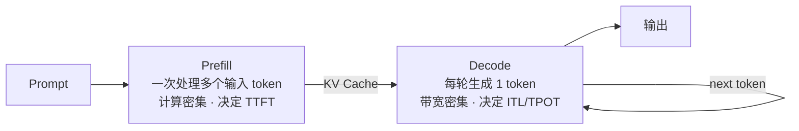
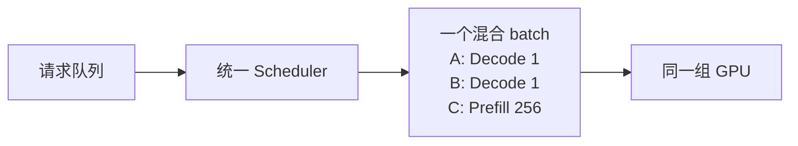
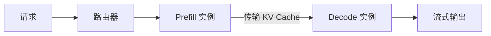
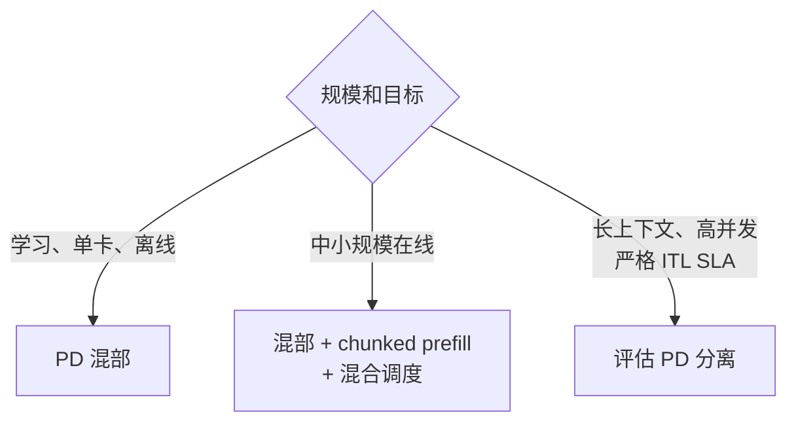

# 推理服务

## PD 部署一图看懂

LLM 推理分为两个阶段：



- **TTFT**：从请求到首 token 的时间。
- **ITL / TPOT**：连续两个输出 token 之间的时间。

> PD 混部/分离讨论“在哪些 GPU 上算”；混合 batching 讨论“同一次 forward 里一起算什么”。

## 三种常见形态

| 形态           | 单个 batch               | 适用场景                         |
| ------------ | ---------------------- | ---------------------------- |
| **混部、分阶段调度** | 纯 Prefill 或纯 Decode    | 教学和简单离线推理；nano-vLLM          |
| **混部、混合调度**  | Decode + Prefill chunk | 单机及中小规模在线服务中更常见；vLLM V1 典型方式 |
| **PD 分离**    | P、D 在不同实例独立执行          | 长上下文、高并发、严格延迟 SLA、多机集群       |

## 1. PD 混部：通用默认方式

P/D 共用模型实例和 GPU。成熟引擎通常优先保证 Decode，再用剩余 token budget 执行 Prefill chunk：



**优点**：部署简单、无需传输 KV Cache、P/D 动态共享 GPU。  
**缺点**：P/D 争用 GPU，长 Prefill 可能抬高 Decode 尾延迟。

nano-vLLM 也是 PD 混部，但实现更简单：

```text
Step 1：纯 Prefill
Step 2：纯 Prefill
Step 3：纯 Decode
```

它支持 chunked prefill，但不把 Prefill chunk 和 Decode token 放进同一个 batch。

## 2. PD 分离：大规模服务选项



P/D 可以独立选择并行策略、硬件数量和扩缩容比例：

```text
长 prompt 增多  → 扩 Prefill 实例
生成并发增多   → 扩 Decode 实例
```

**优点**：Prefill 不干扰 Decode；TTFT 与 ITL 可独立优化。  
**代价**：KV Cache 传输、双侧模型权重、路由和故障恢复更复杂，通常需要 NVLink、IB 或 RoCE。

vLLM、SGLang 都支持 PD 分离，但普通启动默认仍是统一引擎；PD 分离更多用于基础设施成熟的大规模集群。

## Chunked Prefill

长 prompt 不在一次 forward 中算完，而是受 token budget 限制分多轮处理：

```text
1000-token prompt，budget = 256

[0:256] → [256:512] → [512:768] → [768:1000] → Decode
```

前一 chunk 的 K/V 已进入 KV Cache，后一 chunk 只计算新 token，并读取历史 K/V。

- **混部**：缩短单次 Prefill 占用，给 Decode 留出预算。
- **分离**：控制 P 节点显存和公平性，避免超长 prompt 独占节点。

## 怎么选



> 学习顺序：先理解统一引擎中的 Scheduler、Paged KV Cache 和 continuous batching，再看 PD 分离中的 KV 跨实例迁移。
