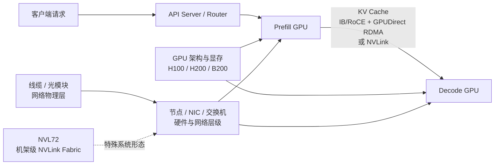

# LLM 推理基础设施知识地图

这组 `00` 卡片只负责建立推理服务的基础心智模型。遇到一个问题时，从本页定位专题，不必按文件名逐张翻找。

## 按问题查卡片

| 我想弄清的问题 | 先看哪张卡 | 关键词 |
| --- | --- | --- |
| 请求怎样进入服务，P/D 如何调度 | [LLM 推理服务：PD 部署与调度](<./00 LLM推理服务：PD部署与调度.md>) | client、API server、router、scheduler、Prefill、Decode、SLA、尾延迟 |
| GPU、节点、机柜、交换机是什么层级 | [GPU 集群硬件与 RDMA 网络层级](<./00 GPU集群硬件与RDMA网络层级.md>) | GPU、CPU、DRAM、SSD、NIC/HCA、PCIe、NVLink、IB、RoCE、RDMA |
| NIC 到交换机之间到底接了什么 | [GPU 集群网络物理层](<./00 GPU集群网络物理层：NIC、光模块与线缆.md>) | DAC、ACC、AOC、光模块、光纤、端口、距离 |
| A100/H100/H200/B200 有什么区别 | [NVIDIA GPU 架构、芯片与量化格式速查](<./00 NVIDIA GPU架构、芯片与量化格式速查.md>) | Ampere、Hopper、Blackwell、HBM、L2、FP8、FP4、AWQ、GPTQ |
| NVL72、NVSwitch、机架级 NVLink 是什么 | [NVL72：机架级 NVLink 系统](<./00 NVL72：机架级NVLink系统.md>) | GB200、GB300、NVLink Fabric、scale-up、scale-out、NVSwitch Tray |

## 两条建议阅读路径

### 从 PD 推理服务出发

```text
PD 部署与调度
  → GPU 集群硬件与 RDMA 网络层级
      → NIC、光模块与线缆（物理层细节）
      → NVL72（特殊的机架级 scale-up 系统）
```

适合先理解“一个请求怎么跑”，再逐层下钻到硬件和网络。

### 从 GPU 硬件出发

```text
NVIDIA GPU 代际速查
  → GPU 集群硬件与 RDMA 网络层级
      → NVL72
  → PD 部署与调度（回到服务应用）
```

适合先区分芯片、板卡、服务器和机架，再理解它们如何服务 LLM 推理。

## 一张图串起来



## 这组卡片的边界

- **总览卡**回答“它是什么、位于哪一层、和相邻概念有什么关系”。
- **专题卡**保留必要的数量级、路径图和官方资料，不堆实现代码。
- nano-vllm 的具体类、函数和执行流程继续放在源码解读卡里，不塞进这些基础卡。

