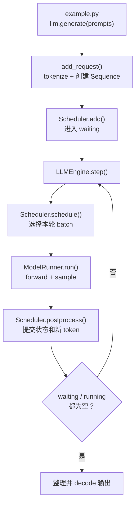
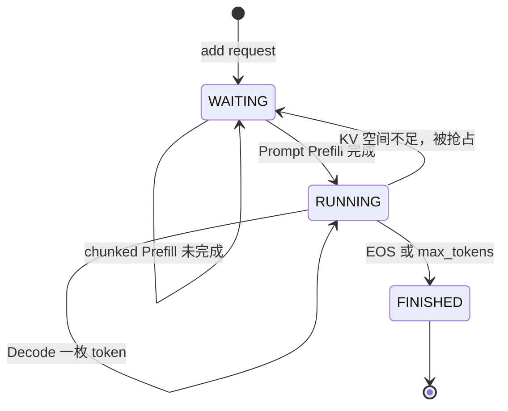

# 从 `example.py` 进入 nano-vLLM 调度循环

> Scheduler 不负责模型计算，它只决定：**这一轮哪些 Sequence 上 GPU、各算多少 token、KV cache 怎么占。**

## 这张卡片的边界

这张卡片讲**控制面**：请求如何从 `example.py` 进入 engine，Scheduler 如何管理 `waiting/running`，以及如何在 Prefill、Decode、token budget 和 KV 容量之间做选择。

它在以下边界停下：

```text
Scheduler.schedule()
    → seqs + is_prefill + Sequence 上的调度状态
    → 交给 ModelRunner
```

`ModelRunner` 如何把这些 Python 状态变成 `input_ids`、`slot_mapping`、`block_tables` 和 FlashAttention metadata，放在 [02 推理框架与 Attention Kernel 的数据链路](<./02 推理框架与Attention Kernel的数据链路.md>)。

## 1. 从 `example.py` 进入调度循环

`example.py` 的核心入口是：

```python
outputs = llm.generate(prompts, sampling_params)
```

`LLM` 没有添加额外逻辑，直接继承 `LLMEngine`。真正的请求入队和 engine step 循环都在 `LLMEngine.generate()` 中：

```python
for prompt, sp in zip(prompts, sampling_params):
    self.add_request(prompt, sp)

while not self.is_finished():
    output, num_tokens = self.step()
```



`LLMEngine.step()` 只有三步核心逻辑：

```python
seqs, is_prefill = self.scheduler.schedule()
token_ids = self.model_runner.call("run", seqs, is_prefill)
self.scheduler.postprocess(seqs, token_ids, is_prefill)
```

```text
schedule       制定计划：本轮算谁、各算多少 token
run            GPU 执行：forward + sample
postprocess    提交结果：推进 KV 水位、追加 token、结束请求
```

---

## 2. Scheduler 管理的核心对象：`Sequence`

看 Scheduler 前，先分清 `Sequence` 中的三个长度：

```python
seq.num_tokens
seq.num_cached_tokens
seq.num_scheduled_tokens
```

| 字段 | 含义 |
|---|---|
| `num_tokens` | 逻辑序列的当前总长度：prompt + 已采样的 completion |
| `num_cached_tokens` | 已经执行 forward，K/V 已写入 cache 的前缀长度 |
| `num_scheduled_tokens` | Scheduler 安排本轮即将计算的 token 数 |

例如 prompt 长 600，本轮只安排前 256 个 token：

```text
调度后、执行前：
num_tokens            = 600
num_cached_tokens     = 0
num_scheduled_tokens  = 256

GPU 执行并 postprocess 后：
num_tokens            = 600
num_cached_tokens     = 256
num_scheduled_tokens  = 0
```

下一轮 Prefill 从 token 256 继续，不会重算 `[0:256)`。

### 采样 token 与 KV cache 存在一轮时间差

```text
本轮采样出 next token
        ↓
append_token()：先进入逻辑 Sequence
        ↓
下一轮 Decode forward
        ↓
该 token 的 K/V 才写入 KV cache
```

所以在正常 Decode 期间，常见的状态是：

```text
num_tokens = num_cached_tokens + 1
```

多出的一个就是刚采样出来、等待下一轮 forward 的 `last_token`。

---

## 3. `waiting` 和 `running` 队列

Scheduler 维护两个 deque：

```python
self.waiting = deque()
self.running = deque()
```

```text
waiting
  新请求，或者被抢占后需要重新 Prefill 的请求

running
  Prompt 已完成 Prefill，正在逐 token Decode 的请求

finished
  已遇到 EOS 或达到 max_tokens，不再属于任何队列
```



`waiting/running` 表示请求处在哪个生命周期，不表示它此刻是否正在 GPU 上执行。

---

## 4. `schedule()` 受三种资源约束

```text
max_num_seqs             一轮最多调度多少条 Sequence
max_num_batched_tokens   一轮最多计算多少个 token
可用 KV blocks             GPU KV cache 能否容纳这些 Sequence
```

`max_num_batched_tokens=16384` 是默认的**单个 engine step token budget**，不是单条 prompt 的长度上限，也不是 KV cache 的总容量。

```python
remaining = self.max_num_batched_tokens - num_batched_tokens
```

例如本轮有五条 prompt：

```text
A = 4000 tokens
B = 4000 tokens
C = 4000 tokens
D = 4000 tokens
E = 1000 tokens
```

放入 A、B、C、D 后：

```text
已用 budget = 16000
剩余 budget = 16384 - 16000 = 384
```

E 需要 1000 token，但剩余 384。由于 batch 中已经有 A、B、C、D，这个实现不会把 E 再切一块塞进本轮：

```python
if remaining < num_tokens and scheduled_seqs:
    break
```

因此它会变成：

```text
本轮 Prefill：[A, B, C, D]
下轮 Prefill：[E]
```

只有 batch 中的第一条 Sequence 可以使用 chunked Prefill：

```text
单条待计算 token = 20000
每轮 budget          = 16384

第一轮 = 16384
第二轮 = 3616
```

> 当前默认 `max_model_len=4096`，因此默认情况下单条正常请求不会超过 16384。更常见的是多条 prompt 的总 token 数超过一轮 budget，被拆成多个 Prefill batch。

---

## 5. Prefill 调度：从 `waiting` 进入 `running`

Scheduler 先尝试调度 Prefill：

```python
while self.waiting and len(scheduled_seqs) < self.max_num_seqs:
    seq = self.waiting[0]
```

### 5.1 首次调度：查 Prefix Cache 并分配 KV blocks

```python
if not seq.block_table:
    num_cached_blocks = self.block_manager.can_allocate(seq)
    if num_cached_blocks == -1:
        break
```

`block_table` 为空，表示该 Sequence 尚未分配 KV blocks，或者之前被抢占后 KV 已被释放。`can_allocate()` 同时检查：

1. 命中了多少个完整 Prefix Cache block。
2. 剩余 prompt 需要的 KV blocks 是否足够。

例如：

```text
block_size       = 256
prompt 长度     = 700
命中 prefix     = 1 个完整 block

num_cached_tokens = 256
需实际 Prefill   = 700 - 256 = 444 tokens
```

### 5.2 决定本轮计算量

```python
seq.num_scheduled_tokens = min(num_tokens, remaining)
```

如果本轮足以完成整个 prompt，Sequence 被放入 `running`：

```python
if seq.num_cached_tokens + seq.num_scheduled_tokens == seq.num_tokens:
    seq.status = SequenceStatus.RUNNING
    self.waiting.popleft()
    self.running.append(seq)
```

这里是 Scheduler 提前标记“本轮执行后将完成 Prefill”。`num_cached_tokens` 要到 GPU 真正执行完、进入 `postprocess()` 时才推进。

只要本轮成功安排到任何 Prefill，Scheduler 就立刻返回：

```python
if scheduled_seqs:
    return scheduled_seqs, True
```

因此当前策略是：

```text
Prefill 优先
Prefill / Decode 不混合到同一 batch
```

在持续有新请求到来的在线场景中，长 Prefill 可能让已在生成的 Decode 请求等待。

---

## 6. Decode 调度：每条 Sequence 每轮一个 token

本轮没有可调度的 Prefill 时，才会进入 Decode：

```python
seq = self.running.popleft()
```

每条 Sequence 只安排一个 token：

```python
seq.num_scheduled_tokens = 1
seq.is_prefill = False
```

它就是已经存在于 Sequence，但尚未写入 KV cache 的 `last_token`。

### 6.1 `may_append()` 不是追加 token

```python
self.block_manager.may_append(seq)
scheduled_seqs.append(seq)
```

`may_append()` 检查 `last_token` 是否刚好进入一个新的逻辑 block；如果是，就先分配一个新的物理 KV block。

例如 `block_size=256`：

```text
序列长度从 255 变为 256   仍在原 block
序列长度从 256 变为 257   进入新 block，需分配物理空间
```

`scheduled_seqs.append(seq)` 才表示它正式进入本轮 Decode batch。

### 6.2 为什么又放回 `running` 队头

假设：

```text
running = [A, B, C]
max_num_seqs = 2
```

本轮通过 `popleft()` 取出 A、B 后：

```text
running        = [C]
scheduled_seqs = [A, B]
```

A、B 只是被临时取出组 batch，它们还没有结束，所以必须重新放回 `running`：

```python
self.running.extendleft(reversed(scheduled_seqs))
```

`extendleft()` 会逐个 `appendleft`，因此需要先 reverse：

```text
reversed([A, B]) = [B, A]

初始       [C]
放入 B  →  [B, C]
放入 A  →  [A, B, C]
```

不 reverse 的话会得到 `[B, A, C]`，破坏原有顺序。

本轮执行后：

- 如果 A 结束，`postprocess()` 会将 A 从 `running` 移除。
- 如果 A 没结束，它保留在队列中，下一轮继续 Decode。

> 这不是 round-robin 公平调度。当 `running` 数量超过 `max_num_seqs` 时，队头请求会持续优先 Decode，后面的请求可能要等前面的请求结束。

---

## 7. KV 空间不足：Recompute Preemption

如果 Sequence 刚进入新 block，但 free KV blocks 不足：

```python
while not self.block_manager.can_append(seq):
    if self.running:
        self.preempt(self.running.pop())
    else:
        self.preempt(seq)
        break
```

Scheduler 优先抢占 `running` 队尾的请求。`preempt()` 会：

```python
seq.status = SequenceStatus.WAITING
seq.is_prefill = True
self.block_manager.deallocate(seq)
self.waiting.appendleft(seq)
```

这是 **recompute preemption**：

```text
释放该请求的全部 KV blocks
        ↓
请求回到 waiting 队头
        ↓
之后重新 Prefill
```

它不会把 KV swap 到 CPU。实现简单，代价是被抢占请求之前的计算被浪费。

---

## 8. `postprocess()`：把本轮计划提交为 KV 事实

ModelRunner 完成 forward 和 sample 后，Scheduler 先执行：

```python
self.block_manager.hash_blocks(seq)
seq.num_cached_tokens += seq.num_scheduled_tokens
seq.num_scheduled_tokens = 0
```

这三步可以理解为一次状态 commit：

```text
hash_blocks()                          登记本轮新写满的 Prefix Cache blocks
num_cached_tokens += scheduled         将“本轮计划”推进为“已写入 KV”
num_scheduled_tokens = 0               清空本轮计划，等待下次调度
```

`hash_blocks()` 必须先执行，因为它需要更新前的 `num_cached_tokens` 与本轮 `num_scheduled_tokens`，才能界定“本轮新写满的 block”。物理 K/V 写入和 block hash 的具体数据链路见 [02 推理框架与 Attention Kernel 的数据链路](<./02 推理框架与Attention Kernel的数据链路.md>)。

### 处理采样结果

Chunked Prefill 尚未覆盖完整 prompt 时：

```python
if is_prefill and seq.num_cached_tokens < seq.num_tokens:
    continue
```

此时产生的临时 logits / sampled token 不是完整 prompt 末尾的最终 next token，因此丢弃，下一轮继续 Prefill suffix。

Prefill 已完成，或本轮是正常 Decode 时：

```python
seq.append_token(token_id)
```

新 token 先进入逻辑 Sequence，下一轮 Decode 才会写入它的 K/V。如果它是 EOS，或 completion 已达 `max_tokens`：

```python
seq.status = SequenceStatus.FINISHED
self.block_manager.deallocate(seq)
self.running.remove(seq)
```

Sequence 结束并立即释放它占用的 KV blocks。

---

## 9. 代入 `example.py` 的两条 prompt

假设两条 prompt 总 token 数未超过 16384，KV 空间也充足。

### 第一个 engine step：Prefill

```text
初始：
waiting = [A, B]
running = []

schedule：
Prefill batch = [A 的全部 prompt token, B 的全部 prompt token]
```

ModelRunner 完成 Prompt forward，并为每条请求采样第一枚 completion token。`postprocess()` 后：

```text
waiting = []
running = [A, B]

A.num_tokens = A.prompt_len + 1
B.num_tokens = B.prompt_len + 1
```

### 第二个 engine step：Decode

`waiting` 为空，Scheduler 选择：

```text
Decode batch = [A.last_token, B.last_token]
```

每条 Sequence 只提交一枚 token，但 Attention 会通过 `block_table` 读取它之前的全部 KV cache，然后各采样下一枚 token。

### 后续 engine steps

```text
schedule Decode
    → forward last_token
    → sample next_token
    → append_token
    → 继续或结束
```

某条请求先结束，就单独从 `running` 移除并释放 KV；其他请求继续生成。

---

## 10. 最终记忆

```text
Sequence       保存一条请求的逻辑 token 和可变状态
Scheduler      管理 waiting/running，决定本轮算谁、算多少
BlockManager   分配、共享、回收物理 KV blocks
ModelRunner    把调度结果变成 GPU input 和 Attention metadata
postprocess    把 GPU 执行结果提交回 Sequence 和 Scheduler
```

阅读 Scheduler 时，始终抓住五点：

1. `waiting/running` 表示请求阶段，不是 CPU/GPU 是否正在执行。
2. `schedule()` 只制定本轮计划，`postprocess()` 才提交执行结果。
3. Prefill 一条 Sequence 每轮可以计算多枚 token；Decode 每条每轮只计算一枚。
4. 新采样 token 要到下一轮 Decode 才产生自己的 K/V。
5. KV cache 不足时，当前实现释放整条 Sequence 的 KV 并重新 Prefill，不做 CPU swap。

下一张卡片是 [02 推理框架与 Attention Kernel 的数据链路](<./02 推理框架与Attention Kernel的数据链路.md>)：从 `Scheduler.schedule()` 的返回值接着往下，看 `num_cached_tokens`、`num_scheduled_tokens` 和 `block_table` 如何变成 `input_ids`、`positions`、`slot_mapping` 和 FlashAttention metadata。
