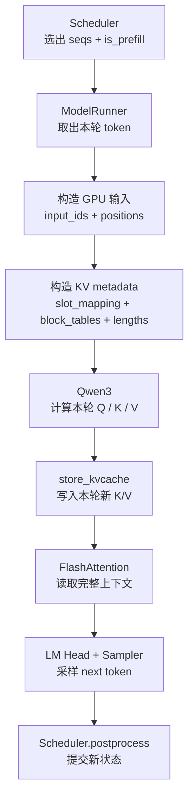
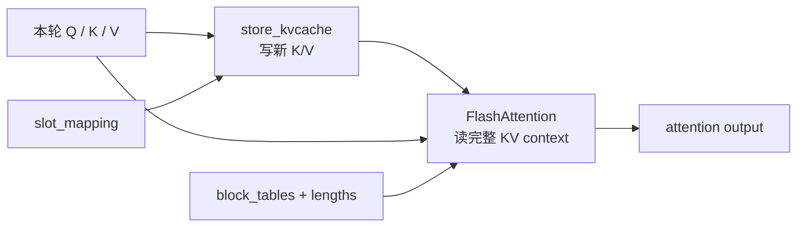

# 推理框架与 Attention Kernel 的数据链路

> Scheduler 决定**本轮算谁**；ModelRunner 把这份计划翻译成 GPU 能执行的 token tensor 和 KV 寻址信息；Attention Kernel 真正完成 K/V 读写和 attention 计算。

## 这张卡片从哪里开始

请求如何从 `example.py` 进入 Scheduler，以及 Prefill / Decode 怎么调度，见 [02 从 example.py 进入 nano-vLLM 调度循环](<./02 调用.md>)。

本卡片从下面这行代码开始：

```python
seqs, is_prefill = self.scheduler.schedule()
```

也就是 Scheduler 已经选好本轮 batch，接下来要回答：

```text
本轮究竟计算哪些 token？
新 token 的 K/V 写到哪里？
Attention 从哪里读取历史 K/V？
```

---

## 1. 先看完整主线



这条链路可以压缩成三句话：

```text
Scheduler      选出本轮要计算的 Sequence
ModelRunner    把 Sequence 状态翻译成 GPU tensor 和 KV metadata
Attention      按 metadata 写新 K/V、读历史 K/V
```

---

## 2. ModelRunner 做的核心事情：翻译

Scheduler 交给 ModelRunner 的仍然是 Python `Sequence` 对象：

```text
seq.token_ids
seq.last_token
seq.num_cached_tokens
seq.num_scheduled_tokens
seq.block_table
```

ModelRunner 将它们翻译成两类 GPU 输入：

### 模型输入：本轮算什么

```text
input_ids    本轮进入模型的 token
positions    这些 token 在原 Sequence 中的位置
```

### KV metadata：K/V 在哪里

```text
slot_mapping   本轮新 K/V 写到哪个物理 slot
block_tables   每条 Sequence 的历史 K/V 分布在哪些物理 blocks
lengths        每条 Sequence 应该读多长，边界在哪里
```

这三个 metadata 中，最容易混淆的是前两个：

| | 回答的问题 | 主要消费者 |
|---|---|---|
| `slot_mapping` | 本轮这枚 token 的 K/V **写到哪里** | `store_kvcache` |
| `block_tables` | 这条 Sequence 的历史 K/V **从哪里读** | FlashAttention |

---

## 3. `block_table` 与 `slot_mapping` 怎么得到

### `block_table`：从逻辑 block 到物理 block

KV cache 的物理 blocks 不需要连续。例如某条 Sequence 的三个逻辑 blocks 可能分布在：

```text
logical block       0     1     2
physical block      7    12     3

seq.block_table = [7, 12, 3]
```

`BlockManager` 负责生成这份映射，ModelRunner 再把多条 Sequence 的 list padding 成 GPU `block_tables`：

```text
seq A: [7, 12, 3]
seq B: [5, 9]

GPU block_tables:
[[7, 12,  3],
 [5,  9, -1]]
```

### `slot_mapping`：精确到一枚 token 的写入位置

```text
slot = physical_block_id × block_size + offset_in_block
```

例如：

```text
physical_block_id = 7
block_size         = 256
offset             = 3

slot = 7 × 256 + 3 = 1795
```

因此可以这样记：

```text
block_tables   是一条 Sequence 的“历史 KV 路线图”
slot_mapping   是本轮新 token 的“精确写入地址”
```

---

## 4. Prefill 与 Decode 只是“本轮 token 数”和“读取 metadata”不同

| | Prefill | Decode |
|---|---|---|
| 本轮每条 Sequence 的输入 | 一个或多个新 token | `last_token` 一枚 |
| `input_ids` 总长度 | 所有 Prefill chunk 的 token 总数 | Sequence 数，也就是 batch size |
| 边界 / 长度 | `cu_seqlens_q/k` | `context_lens` |
| 历史 KV | 有 cached prefix 时用 `block_tables` | 始终用 `block_tables` |
| Attention Kernel | `flash_attn_varlen_func` | `flash_attn_with_kvcache` |

### Prefill 怎么取 token

```python
start = seq.num_cached_tokens
end = start + seq.num_scheduled_tokens

input_ids = seq[start:end]
positions = range(start, end)
```

假设：

```text
num_cached_tokens    = 256
num_scheduled_tokens = 100
```

那么：

```text
本轮 query token = [256:356)   只计算新 suffix
Attention key 范围 = [0:356)     读取完整前缀
```

`cu_seqlens_q/k` 用来标记多条 Sequence 被压成扁平 tensor 后，每条 Sequence 的边界在哪里。

### Decode 怎么取 token

```python
input_ids    = seq.last_token
positions    = len(seq) - 1
context_lens = len(seq)
```

Decode 只计算尚未写入 KV cache 的 `last_token`，但 Attention 会通过 `block_tables + context_lens` 读到它之前的全部历史 K/V。

---

## 5. Attention 内部：先写新 K/V，再做 Attention

Qwen3 先为本轮 token 生成 `q/k/v`，然后 `Attention.forward()` 执行两步：



### 第一步：写

```python
store_kvcache(k, v, k_cache, v_cache, slot_mapping)
```

Triton Kernel 按 `slot_mapping` 把本轮连续产生的 K/V scatter 到不连续的 Paged KV Cache slots。

### 第二步：读

```text
Prefill   通过 cu_seqlens 隔离不同 Sequence；有缓存前缀时按 block_tables 读
Decode    通过 block_tables 定位 blocks，通过 context_lens 确定读多长
```

所以 Decode 的 `context_lens` 包含本轮 token：这枚 token 的 K/V 已经在 Attention 开始时先写入 cache，紧接着就可以和全部历史 KV 一起被读取。

---

## 6. Attention 结果怎么回到 Scheduler

```text
attention output
  → 后续 Transformer layers
  → LM Head 得到 logits
  → Sampler 采样 next_token_ids
  → Scheduler.postprocess()
```

Prefill 虽然可能计算很多 token，但 next-token sampling 只需要每条 Sequence 最后一个 query position 的 logits。因此 Sampler 始终为每条 Sequence 返回一枚 token。

`postprocess()` 再把 GPU 已完成的计算提交回 Sequence：

```python
self.block_manager.hash_blocks(seq)
seq.num_cached_tokens += seq.num_scheduled_tokens
seq.num_scheduled_tokens = 0
```

```text
hash_blocks()                  登记本轮新写满的 Prefix Cache blocks
推进 num_cached_tokens        本轮 token 现在已经有 KV
清空 num_scheduled_tokens     本轮调度计划已消费
append_token(token_id)         把采样结果追加进逻辑 Sequence
```

例外是尚未完成的 chunked Prefill：它只推进 KV 水位，本轮临时采样的 token 会被丢弃，不执行 `append_token()`。

---

## 7. 最终只记这张表

| 组件 | 只问它一个问题 |
|---|---|
| Scheduler | 本轮算谁？ |
| BlockManager | 这条 Sequence 占哪些物理 KV blocks？ |
| ModelRunner | 怎么把 Sequence 变成 GPU 输入和 metadata？ |
| `slot_mapping` | 新 K/V 写到哪里？ |
| `block_tables + lengths` | 历史 K/V 从哪里读、读多少？ |
| Attention | 怎么先写本轮 K/V，再读完整 context？ |
| Sampler | 每条 Sequence 的 next token 是什么？ |
| `postprocess()` | 怎么把 GPU 结果提交回 Sequence？ |

连起两张卡片：

```text
[02 调用]
example.py → LLMEngine → Scheduler 决定“算谁”
                                  ↓
[本卡片]
ModelRunner → KV 读写 → Attention → Sampler 解释“怎么算”
```
