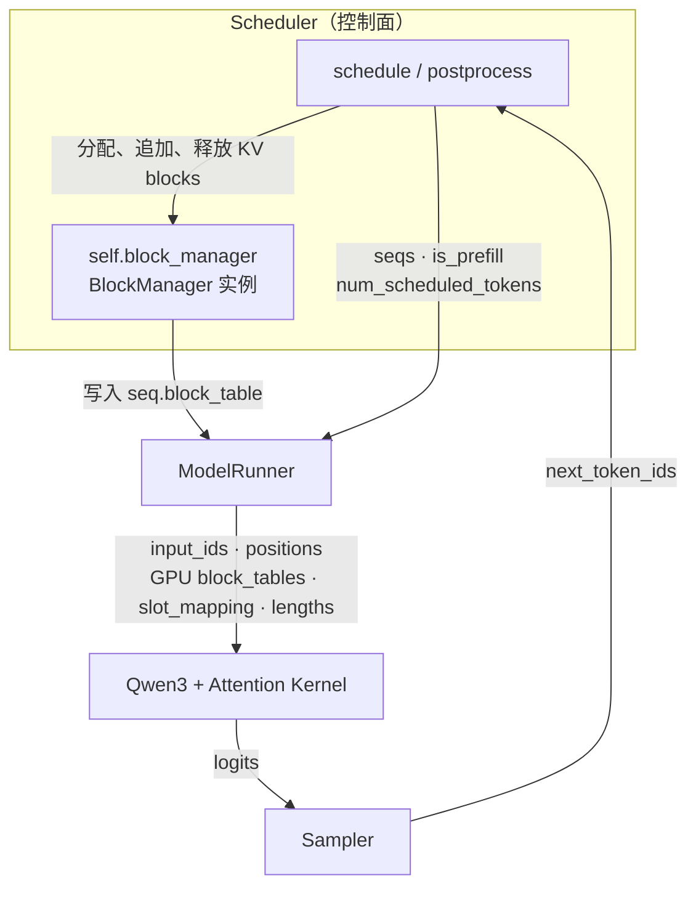
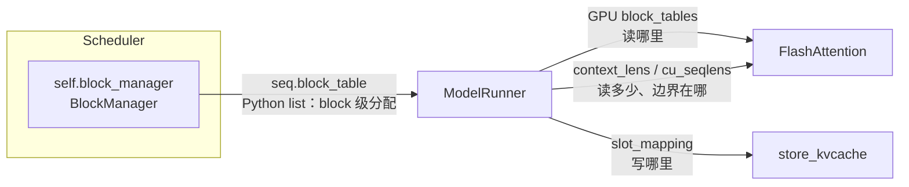

# 推理框架与 Attention Kernel 的数据链路

## 核心：四份接口契约



> BlockManager 不是 Scheduler 的方法，而是它持有的成员对象。它先完成 block 级分配，ModelRunner 再把分配结果翻译成 kernel metadata。

| 契约 | 生产者 | 核心产物 | 消费者 |
|---|---|---|---|
| **1. 调度** | Scheduler | `seqs`, `is_prefill`, `num_scheduled_tokens` | ModelRunner |
| **2a. Block 分配** | BlockManager（由 Scheduler 持有、调用） | 每条请求的 `seq.block_table` | ModelRunner |
| **2b. Kernel 寻址** | ModelRunner | GPU `block_tables`, `slot_mapping`, `context_lens/cu_seqlens` | KV 写入 Kernel、FlashAttention |
| **3. 模型计算** | Qwen3 Attention | `q`, `k`, `v` | `store_kvcache`、FlashAttention |
| **4. 状态提交** | Sampler | `next_token_ids` | `Scheduler.postprocess` |

## 1. 调度契约：本轮算谁、算多少

Scheduler 从 `waiting/running` 队列选择请求：

```text
seqs                  本轮参与计算的请求
is_prefill            本轮走 Prefill 还是 Decode
num_scheduled_tokens  每条请求本轮计算多少 token
```

ModelRunner 消费这些 Python 对象，并生成真正送入 GPU 的 `input_ids` 和 `positions`。

## 2. KV 寻址契约：两级翻译

这份协议由两个组件依次完成：



### 第一级：BlockManager 分配物理 blocks

Scheduler 调用成员对象 `self.block_manager`，为每条 Sequence 建立映射：

```text
logical block：    0    1    2
physical block：   7   12    3

seq.block_table = [7, 12, 3]
```

它仍是 Sequence 上的 Python list，直接消费者是 ModelRunner，不是 GPU kernel。

### 第二级：ModelRunner 生成 kernel metadata

ModelRunner 将多条请求的 `seq.block_table` padding 并转成 GPU tensor：

```text
seq A: [7, 12, 3]
seq B: [5, 9]

GPU block_tables:
[[7, 12,  3],
 [5,  9, -1]]
```

FlashAttention 消费 GPU `block_tables`。ModelRunner 同时派生另外两类 metadata：

#### `slot_mapping`：写哪里

ModelRunner 把每个新 token 转换成扁平物理写地址：

```text
slot = physical_block_id × block_size + offset

block 7，block_size 256，offset 3
slot = 7 × 256 + 3 = 1795
```

`store_kvcache` 消费 `slot_mapping`，把本轮连续生成的 `k/v` scatter 到 Paged KV Cache。

#### `context_lens / cu_seqlens`：读多少

```text
Decode：context_lens
每条请求当前有效的完整 KV 长度

Prefill：cu_seqlens_q / cu_seqlens_k
扁平 batch 中各 sequence 的 query/key 边界
```

FlashAttention 用它们隔离不同请求，避免读到 padding 或其他 sequence 的 KV。

## 3. 模型计算契约：Q/K/V 如何进入 Kernel

Qwen3 Attention 层生产本轮 token 的：

```text
q：当前 token 用什么内容查询
k/v：当前 token 写入 KV Cache 的内容
```

消费者分为两条路径：

```text
k/v + slot_mapping
    → store_kvcache
    → 写入新 KV

q + GPU block_tables + lengths + KV Cache
    → FlashAttention
    → attention output
```

Prefill 与 Decode 的差异只在 metadata 和 query 数量：

| | Prefill | Decode |
|---|---|---|
| 每条请求的 query | 多个新 token | 最新 1 个 token |
| 边界/长度 | `cu_seqlens_q/k` | `context_lens` |
| 历史 KV | prefix 命中时按 `block_table` 读取 | 始终按 `block_table` 读取 |

## 4. 状态提交契约：结果回到框架

```text
Attention output
→ 后续 Transformer 层
→ LM Head 得到 logits
→ Sampler 得到 next_token_ids
→ Scheduler.postprocess
```

`postprocess` 负责：

- 把 next token 追加到 `Sequence`。
- 推进 `num_cached_tokens`。
- 登记新写满的 prefix-cache blocks。
- 判断 EOS / `max_tokens`，结束并释放 KV blocks。

## 最终记忆

```text
Scheduler       持有 BlockManager，决定算谁、算多少
BlockManager    写入 seq.block_table（block 级分配）
ModelRunner     生成 GPU block_tables、slot_mapping 和 lengths
KV Kernel       按 slot_mapping 写新 K/V
FlashAttention  按 GPU block_tables 和 lengths 读历史 K/V
Sampler         产生 next token，交回 Scheduler 提交
```
