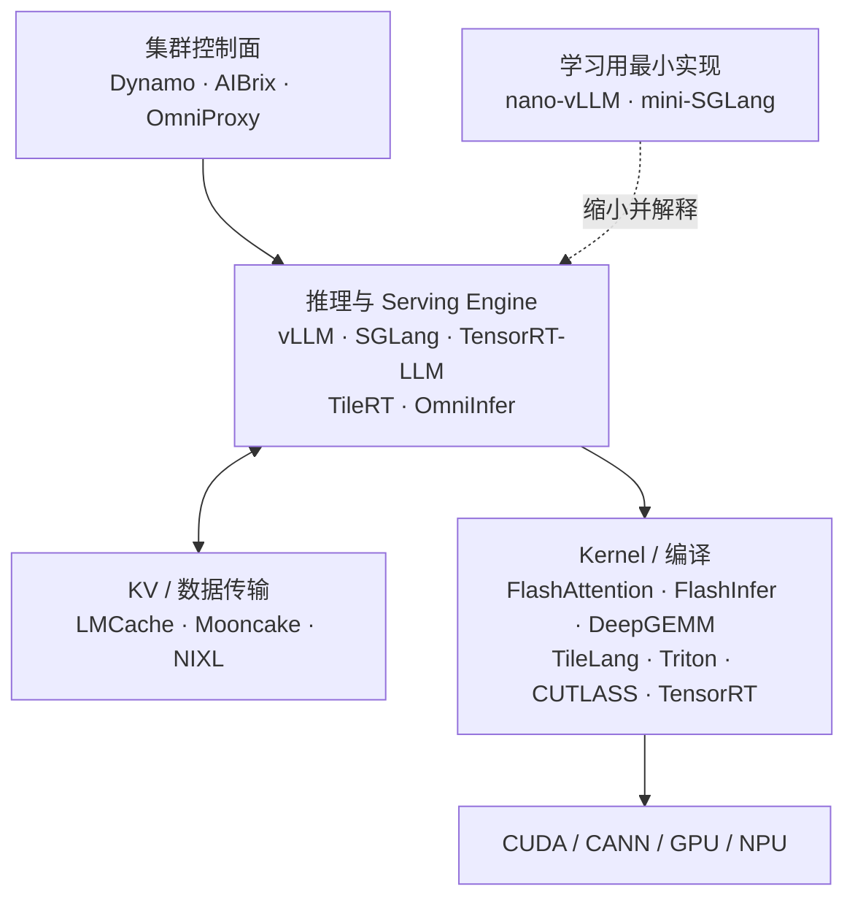

# 推理优化仓库分层卡片

> 先判断仓库解决哪一层问题，再比较性能。`nano-vLLM`、`FlashInfer` 和 `OmniProxy` 都与推理优化有关，但分别属于引擎、Kernel 和集群调度层，不能直接横向替代。

## 一张图定位



## 快速检索：功能与开发者

> “发起 / 主要维护者”描述项目的技术来源与主要社区，不等同于法律所有权；社区项目可能由多家公司共同贡献。可直接用 `Ctrl+F` 检索功能、硬件或开发者。

| 检索关键词                                      | 项目                                                             | 核心功能                                                | 发起 / 主要维护者                         |
| ------------------------------------------ | -------------------------------------------------------------- | --------------------------------------------------- | ---------------------------------- |
| 教学、Scheduler、Paged KV                      | [nano-vLLM](https://github.com/GeeeekExplorer/nano-vllm)       | 最小化实现 LLM Engine、Scheduler、BlockManager、ModelRunner | Xingkai Yu / 社区                    |
| 教学、Radix Cache、Overlap                     | [mini-SGLang](https://github.com/sgl-project/mini-sglang)      | SGLang 核心机制的紧凑实现                                    | SGLang 社区（`sgl-project`）           |
| Serving、PagedAttention、Continuous Batching | [vLLM](https://github.com/vllm-project/vllm)                   | 通用 LLM 推理与在线服务引擎                                    | UC Berkeley 发起 / vLLM 社区           |
| Serving、Radix Cache、结构化生成                  | [SGLang](https://github.com/sgl-project/sglang)                | LLM/多模态 Serving、前缀复用与高性能调度                          | LMSYS / UC Berkeley 发起，SGLang 社区维护 |
| NVIDIA、LLM Engine、量化                       | [TensorRT-LLM](https://github.com/NVIDIA/TensorRT-LLM)         | NVIDIA GPU 上的 LLM Kernel、Runtime、并行与 Serving        | NVIDIA                             |
| NVIDIA、图优化、Engine                          | [TensorRT](https://github.com/NVIDIA/TensorRT)                 | 通用模型图编译、算子融合、Tactic 选择与执行 Runtime                   | NVIDIA                             |
| B200、低 TPOT、Decode                         | [TileRT](https://github.com/tile-ai/TileRT)                    | 面向受支持超大模型的超低延迟 Decode Runtime                       | Tile-AI 团队 / 社区                    |
| 昇腾、MoE、PD、vLLM 增强                          | [OmniInfer](https://gitee.com/omniai/omniinfer)                | vLLM 上的昇腾算子、MoE、KV 和 PD 系统优化                        | 华为昇腾团队 / Omni AI 社区                |
| 昇腾、PD 路由、APC                               | [OmniProxy](https://gitee.com/omniai/omni-proxy)               | 跨 P/D 实例的请求调度、负载均衡和缓存感知转发                           | 华为昇腾团队 / Omni AI 社区                |
| 集群、PD、KV-aware、扩缩容                         | [Dynamo](https://github.com/ai-dynamo/dynamo)                  | 编排 vLLM、SGLang、TensorRT-LLM 的数据中心级推理栈               | NVIDIA / `ai-dynamo` 社区            |
| Kubernetes、Gateway、Autoscaling             | [AIBrix](https://github.com/vllm-project/aibrix)               | 云原生推理控制面、路由、扩缩容和分布式 KV                              | 字节跳动基础设施团队发起 / vLLM 社区托管           |
| KV 复用、Offload、分层缓存                         | [LMCache](https://github.com/LMCache/LMCache)                  | 管理 KV 的存储、复用、淘汰、观测和跨 Engine 共享                      | LMCache 社区 / PyTorch Foundation 项目 |
| KV Store、RDMA、PD                           | [Mooncake](https://github.com/kvcache-ai/Mooncake)             | 分布式 KV 存储、Transfer Engine 与 KV-centric Serving      | 月之暗面（Moonshot AI）/ Kimi 团队         |
| KV 传输、GPU/CPU/SSD、RDMA                     | [NIXL](https://github.com/ai-dynamo/nixl)                      | 为 KV、权重等提供跨内存层级和跨节点传输接口                             | NVIDIA / `ai-dynamo` 社区            |
| Attention、长序列、显存优化                         | [FlashAttention](https://github.com/Dao-AILab/flash-attention) | IO-aware 精确 Attention Kernel                        | Tri Dao / Dao-AILab                |
| Attention、Paged KV、Sampling、MoE            | [FlashInfer](https://github.com/flashinfer-ai/flashinfer)      | 面向 LLM Serving 的综合 Kernel 库与生成器                     | FlashInfer 团队 / 社区                 |
| GEMM、FP8/FP4、Grouped GEMM、MoE              | [DeepGEMM](https://github.com/deepseek-ai/DeepGEMM)            | 面向 Tensor Core 的 GEMM 与融合 MoE Kernel 库              | DeepSeek                           |
| Kernel DSL、Tile、Pipeline、Layout            | [TileLang](https://github.com/tile-ai/tilelang)                | 基于 TVM 基础设施开发高性能多后端 Kernel                          | Tile-AI 团队 / 社区                    |
| Kernel DSL、JIT、GPU 编译器                     | [Triton](https://github.com/triton-lang/triton)                | 用 Python 风格语言编写并 JIT 编译 GPU Kernel                  | OpenAI 发起 / Triton 社区              |
| CUDA、CuTe、GEMM、模板库                         | [CUTLASS](https://github.com/NVIDIA/cutlass)                   | CUDA C++ 模板与 DSL，构建高性能线性代数 Kernel                   | NVIDIA                             |

### KV 三件套怎么组合

```text
LMCache  ：管理 KV——缓存什么、放哪里、何时复用或淘汰
Mooncake ：提供分布式 KV Store 和自己的高速 Transfer Engine
NIXL     ：搬运数据——统一 GPU / CPU / SSD / 跨节点传输接口

常见组合：vLLM → LMCache → Mooncake（存储）/ NIXL（传输）
注意：Mooncake 自带 Transfer Engine，三者不是必须同时使用。
```

### Kernel 相关项目怎么分

```text
现成算子库：FlashAttention / FlashInfer / DeepGEMM
Kernel DSL：Triton / TileLang
底层模板与构件：CUTLASS / CuTe
整图编译与 Runtime：TensorRT
```

## 核心仓库

| 层级        | 仓库                                                        | 一句话定位                                              | 与 vLLM 的关系                            |
| --------- | --------------------------------------------------------- | -------------------------------------------------- | ------------------------------------- |
| 学习引擎      | [nano-vLLM](https://github.com/GeeeekExplorer/nano-vllm)  | 用少量代码实现 Scheduler、Paged KV、ModelRunner 和 TP        | vLLM 的最小教学版，不是生产插件                    |
| 学习引擎      | [mini-SGLang](https://github.com/sgl-project/mini-sglang) | 展示 Radix Cache、Chunked Prefill、Overlap Scheduling  | SGLang 的紧凑参考实现                        |
| 通用引擎      | [vLLM](https://github.com/vllm-project/vllm)              | 模型覆盖广，Continuous Batching、PagedAttention、PD 分离生态成熟 | 基准坐标                                  |
| 通用引擎      | [SGLang](https://github.com/sgl-project/sglang)           | 强调 Prefix/Radix Cache、结构化生成和高性能调度                  | vLLM 的直接竞品                            |
| NVIDIA 引擎 | [TensorRT-LLM](https://github.com/NVIDIA/TensorRT-LLM)    | NVIDIA LLM 专用 Kernel、量化、Runtime 与 Serving          | 与 vLLM/SGLang 同层竞争；不是基础 TensorRT 的同义词 |
| 专用引擎      | [TileRT](https://github.com/tile-ai/TileRT)               | 面向少数超大模型和 B200 的极低 TPOT Decode                     | 可替代 Decode，也可与 vLLM Prefill 组合        |
| 昇腾套件      | [OmniInfer](https://gitee.com/omniai/omniinfer)           | 基于 vLLM 增加昇腾算子、MoE、KV 与 PD 优化                      | vLLM 的系统级增强，不是从零重写的引擎                 |
| PD 调度     | [OmniProxy](https://gitee.com/omniai/omni-proxy)          | 全局选 P/选 D、负载均衡、APC 感知和流式转发                         | 位于 P/D vLLM 实例之外，不替代实例内 Scheduler     |

## 容易漏掉的上下游

| 方向                         | 重点仓库                                                                                                                                         | 什么时候看                                                   |
| -------------------------- | -------------------------------------------------------------------------------------------------------------------------------------------- | ------------------------------------------------------- |
| Attention / Serving Kernel | [FlashAttention](https://github.com/Dao-AILab/flash-attention)、[FlashInfer](https://github.com/flashinfer-ai/flashinfer)                     | 追踪 Attention、Paged/Ragged KV、Prefill/Decode Kernel 数据接口 |
| GEMM / MoE Kernel          | [DeepGEMM](https://github.com/deepseek-ai/DeepGEMM)                                                                                          | 研究 FP8 GEMM、Grouped GEMM 和 MoE 热点                       |
| Kernel DSL                 | [TileLang](https://github.com/tile-ai/tilelang)、[Triton](https://github.com/triton-lang/triton)、[CUTLASS](https://github.com/NVIDIA/cutlass) | 自己写或读高性能算子；TileLang 与 TileRT 不是同一层                      |
| KV 复用 / 传输                 | [LMCache](https://github.com/LMCache/LMCache)、[Mooncake](https://github.com/kvcache-ai/Mooncake)、[NIXL](https://github.com/ai-dynamo/nixl)   | PD 分离、跨实例 KV 传输、KV offload 与分布式缓存                       |
| 集群控制面                      | [Dynamo](https://github.com/ai-dynamo/dynamo)、[AIBrix](https://github.com/vllm-project/aibrix)                                               | 多副本路由、扩缩容、SLA、Kubernetes 与数据中心级 Serving                 |

## 三组不要混淆

```text
TensorRT       ：通用图编译与执行 Runtime
TensorRT-LLM   ：完整 LLM 推理引擎，才适合与 vLLM / SGLang 比较

TileLang       ：写高性能 Kernel 的 DSL
TileRT         ：使用 tile 级运行时思想的专用 LLM Engine

vLLM Scheduler ：单个 Engine 内按 step 组 batch、分配 KV blocks
OmniProxy      ：Engine 外跨 P/D 实例进行请求级全局调度
```

## 按目标阅读

```text
理解引擎主链路：nano-vLLM → mini-SGLang → vLLM / SGLang
理解 GPU 热点：FlashAttention → FlashInfer → DeepGEMM / TileLang
理解 PD 分离：vLLM KV Connector → LMCache / Mooncake / NIXL → OmniProxy
理解厂商方案：TensorRT → TensorRT-LLM；vLLM → OmniInfer
理解集群 Serving：OmniProxy → Dynamo / AIBrix
```

## 可选延伸，不放入主链路

- [TGI](https://github.com/huggingface/text-generation-inference)、[LMDeploy](https://github.com/InternLM/lmdeploy)：偏完整部署产品或工具链，可作为 vLLM/SGLang 的其他方案。
- [llama.cpp](https://github.com/ggml-org/llama.cpp)、[MLC-LLM](https://github.com/mlc-ai/mlc-llm)：更偏本地、端侧和跨平台部署。
- 量化仓库应另开一张卡片讨论；它们改变权重和计算精度，但不等同于 Serving Engine、PD 调度或 Kernel DSL。

> 当前这套清单已经覆盖“学习实现 → Serving Engine → Kernel → KV/PD → 集群控制面”的主链路。后续遇到新仓库，先把它放入其中一层，再判断它是替代、增强还是被调用关系。
