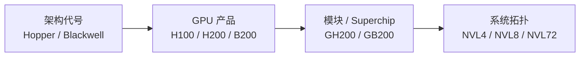
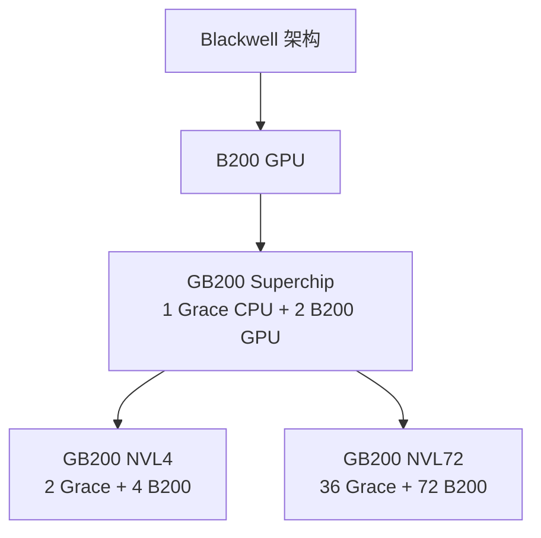

# NVIDIA GPU 架构、芯片与量化格式速查

> 导航：[文档索引](<./00 索引：LLM推理基础设施知识地图.md>)

> **H200 仍属于 Hopper，B200 才属于 Blackwell。GB200 是 Grace CPU + B200 GPU 的 Superchip，NVL72 是机架级系统拓扑。**

## 先分清四层名字



| 层级 | 例子 | 表示什么 |
| --- | --- | --- |
| **架构代号** | Volta、Turing、Ampere、Ada、Hopper、Blackwell、Rubin | GPU 微架构与 Tensor Core 代际 |
| **GPU 型号** | V100、T4、A100、L4、H100、H200、B200、B300 | 一颗/一个 GPU 产品 SKU |
| **CPU–GPU 模块** | GH200、GB200、GB300 | Grace CPU 与 GPU 通过 NVLink-C2C 组成的模块 |
| **系统形态** | HGX H200、DGX B200、GB200 NVL72 | 多个 GPU/模块如何组成服务器或机架 |

## 数据中心 GPU 代际速查

> 下表聚焦 AI 推理/训练中常见的 Tensor Core 路径，不枚举 GPU 所有标量指令和所有 SKU。

| 架构 | 常见 GPU | 主要使用场景 | 代表性原生 Tensor Core 低精度 |
| --- | --- | --- | --- |
| **Volta** | V100 | 历史性 AI 训练、HPC | FP16（第一代 Tensor Core） |
| **Turing** | T4 | 低功耗推理、视频转码 | FP16、INT8、INT4 |
| **Ampere** | A100、A30 | 通用训练/推理、HPC、MIG | TF32、BF16、FP16、INT8、INT4 |
| **Ada Lovelace** | L4、L40、L40S | 节能推理、图像/视频、渲染 | FP8、BF16/FP16、TF32、INT8、INT4 |
| **Hopper** | H100、H200 | 大模型训练/推理、HPC、机密计算 | FP8、BF16/FP16、TF32、INT8 |
| **Blackwell** | B100、B200 | 大模型训练、低精度高吞吐推理、MoE | FP4/NVFP4、FP6、FP8/MXFP8、INT8、BF16/FP16、TF32 |
| **Blackwell Ultra** | B300 | reasoning/test-time scaling、长上下文、更大模型 | 延续 Blackwell 低精度家族，重点强化 NVFP4 |
| **Rubin** | Rubin GPU | 下一代 agentic AI、超大 MoE 训练/推理 | NVFP4、FP8/FP6、INT8、BF16/FP16、TF32（已公布规格） |

Rubin 的当前产品数据仍标注为 preliminary；本卡状态截止 2026-08-23。

## 几个典型 GPU 的硬件层级对比

> 以常见数据中心 SXM 版本建立数量级直觉；不同 SKU 的容量和峰值可能不同。

| GPU | 架构 | 封装直觉 | HBM | HBM 带宽 | L2 Cache | L1/Shared 上限 | NVLink 双向带宽 |
| --- | --- | --- | ---: | ---: | ---: | ---: | ---: |
| **A100 80GB** | Ampere | 单片大 GPU die | 80 GB HBM2e | 约 2.0 TB/s | 40 MB | 192 KB/SM | 600 GB/s |
| **H100 SXM** | Hopper | 单片大 GPU die | 80 GB HBM3 | 约 3.35 TB/s | 50 MB | 256 KB/SM | 900 GB/s |
| **H200 SXM** | Hopper | 与 H100 同代，重点升级显存 | 141 GB HBM3e | 约 4.8 TB/s | 50 MB | 256 KB/SM | 900 GB/s |
| **B200** | Blackwell | 两个大 die 组成一个 GPU | 180 GB HBM3e | 最高约 8 TB/s | 126 MB | 256 KB/SM | 1.8 TB/s |

```text
SM / Tensor Core
  ↔ Register                    最快、最小
  ↔ Shared Memory / L1          每个 SM 局部
  ↔ L2 Cache                    整个 GPU 共享
  ↔ HBM                         保存权重、激活、KV Cache
  ↔ NVLink / PCIe               离开本 GPU
```

- **L2 更大**：更多热点 tile、attention 数据和元数据可避免重新读 HBM；但 126 MB 仍远小于数十/数百 GB 模型，不是用来装整个模型。
- **HBM 更大/更快**：能放更大模型和更多 KV Cache，对 memory-bound 的 Decode 尤其重要。
- **NVLink 更快**：多 GPU Tensor/Expert Parallel 交换 activation 和 collective 时，更不容易让计算单元等待通信。
- **面积不能单独解释性能**：制程和晶体管密度不同；Blackwell 还从单片 GPU 转向两个 reticle-scale die，用高带宽 die-to-die 互连对 CUDA 呈现为一个 GPU。

## H100 和 H200：都是 Hopper

```text
Hopper
├── H100：80 GB HBM3（SXM 常见配置）
└── H200：141 GB HBM3e，容量和带宽更高
```

H200 不是 Hopper 之后的新架构，而是增强显存系统的 Hopper GPU：它与 H100 一样支持 FP8 Transformer Engine、FP16/BF16、TF32 和 INT8，但用 141 GB HBM3e 和约 4.8 TB/s 显存带宽更适合容量/带宽敏感的 LLM 推理。

## B200、GB200 和 NVL72：不是同一层



- **B200**：Blackwell 代数据中心 GPU，原生 Tensor Core 路径加入 FP4/FP6 等更低精度。
- **GB200**：Grace Blackwell Superchip，一个 Grace CPU 通过 NVLink-C2C 连接两个 B200 GPU。
- **GB200 NVL72**：36 个 GB200 Superchip 构成的 72-GPU 机架级 NVLink 系统。

## “支持量化”要问四层

```text
1. 模型文件能否加载？
2. 推理框架有没有对应 kernel？
3. kernel 是否真正使用 Tensor Core 原生低精度指令？
4. 端到端是否真的更快，而不是被反量化、内存或 shape 开销抵消？
```

### 硬件数据格式

FP8、INT8、INT4、NVFP4、MXFP8 描述数值表示或带 block scaling 的计算 recipe。芯片规格中的“FP8/FP4 Tensor Core”指硬件有对应矩阵计算路径。

### 模型量化方案

AWQ、GPTQ、bitsandbytes、GGUF 是算法、存储布局或软件生态，不是 GPU 架构的原生数据类型。

```text
W4A16 = 权重 4 bit，激活 16 bit
W8A8  = 权重 8 bit，激活 8 bit
W4A4  = 权重和激活都为 4 bit
```

例如 Hopper 可以通过 AWQ/GPTQ kernel 运行 4-bit 权重模型，但常见路径是在计算时反量化到 FP16/BF16 或使用特化的 weight-only kernel；这不等于 Hopper 拥有 Blackwell 式的原生 NVFP4 Tensor Core 路径。

## 选型直觉

```text
低功耗、视频/通用推理       → T4 / L4
图形、视频 + 较强 AI 推理  → L40S
成熟训练、HPC、通用集群     → A100
大模型 FP8 训练/推理          → H100
更大显存、更高带宽 Hopper   → H200
原生 FP4/FP6、MoE、高吞吐推理 → B200
更大 HBM、reasoning/test-time scaling → B300
```

真实选型还要同时考虑显存容量/带宽、功耗、价格、集群互联、框架 kernel 成熟度和延迟 SLA，不能只看理论低精度 FLOPS。

## NVIDIA 官方资料

- [NVIDIA T4 Datasheet](https://www.nvidia.com/content/dam/en-zz/Solutions/Data-Center/tesla-t4/t4-tensor-core-datasheet.pdf)：Turing 上的 FP16、INT8 和 INT4。
- [NVIDIA A100 / Ampere Architecture](https://www.nvidia.com/content/dam/en-zz/Solutions/Data-Center/nvidia-ampere-architecture-whitepaper.pdf)：Ampere Tensor Core 的 TF32、BF16、INT8/INT4 等路径。
- [NVIDIA Ampere Tuning Guide](https://docs.nvidia.com/cuda/archive/13.0.0/ampere-tuning-guide/index.html)：A100 的 L1/Shared、L2 和 NVLink 层级。
- [NVIDIA Ada GPU Architecture](https://images.nvidia.com/aem-dam/Solutions/Data-Center/l4/nvidia-ada-gpu-architecture-whitepaper-V2.02.pdf)：L4/L40 的 FP8、FP16/BF16、INT8 和 INT4 规格。
- [NVIDIA Hopper Architecture](https://www.nvidia.com/en-us/data-center/technologies/hopper-architecture/)：H100/H200、FP8 Transformer Engine 和 Hopper Tensor Core。
- [NVIDIA Hopper Tuning Guide](https://docs.nvidia.com/cuda/hopper-tuning-guide/)：H100/H200 的 L1/Shared、L2 和 NVLink 层级。
- [NVIDIA H200](https://www.nvidia.com/en-us/data-center/h200/)：H200 的 Hopper 归属、141 GB HBM3e 与低精度规格。
- [NVIDIA Blackwell Tuning Guide](https://docs.nvidia.com/cuda/archive/13.0.2/pdf/Blackwell_Tuning_Guide.pdf)：B200/GB200 的 L1/Shared 与 L2 层级。
- [NVIDIA HGX Reference Architecture](https://docs.nvidia.com/enterprise-reference-architectures/whitepaper/hgx-servers-and-spectrum-x.pdf)：H200、B200、B300 的 HBM 容量和带宽对比。
- [NVIDIA Blackwell SM100 GEMMs](https://docs.nvidia.com/cutlass/latest/media/docs/cpp/blackwell_functionality.html)：Blackwell Tensor Core 的 FP4/FP6/FP8 和 block-scaled MMA。
- [NVIDIA NVFP4](https://docs.nvidia.com/deeplearning/transformer-engine/user-guide/features/low_precision_training/nvfp4/nvfp4.html)：NVFP4 E2M1、block scaling 与支持设备。
- [NVIDIA Blackwell Ultra](https://developer.nvidia.com/blog/inside-nvidia-blackwell-ultra-the-chip-powering-the-ai-factory-era/)：B300 架构、NVFP4 和 HBM3e。
- [NVIDIA Vera Rubin NVL72](https://www.nvidia.com/en-us/data-center/vera-rubin-nvl72/)：Rubin GPU 的当前 preliminary 低精度规格。
