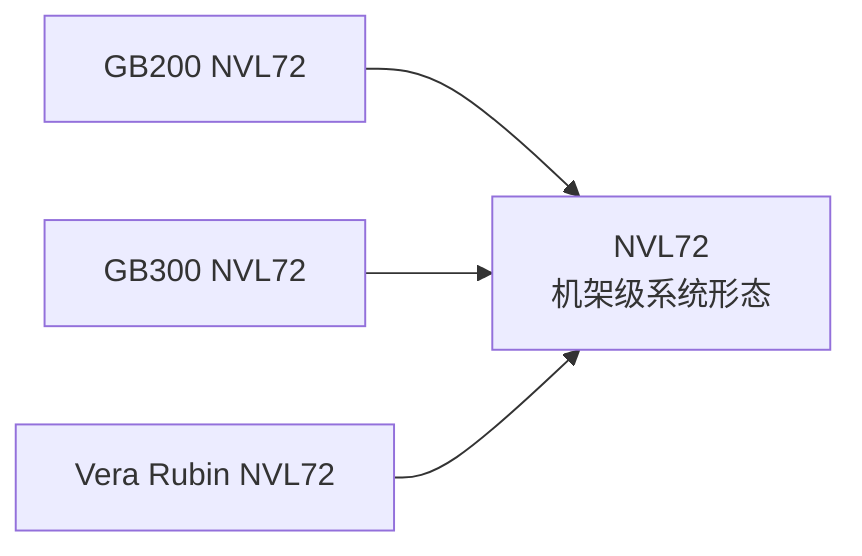
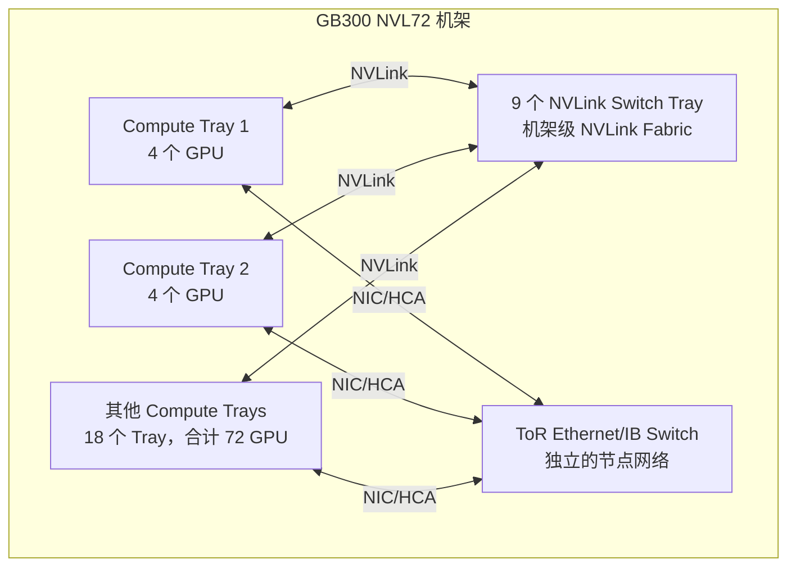
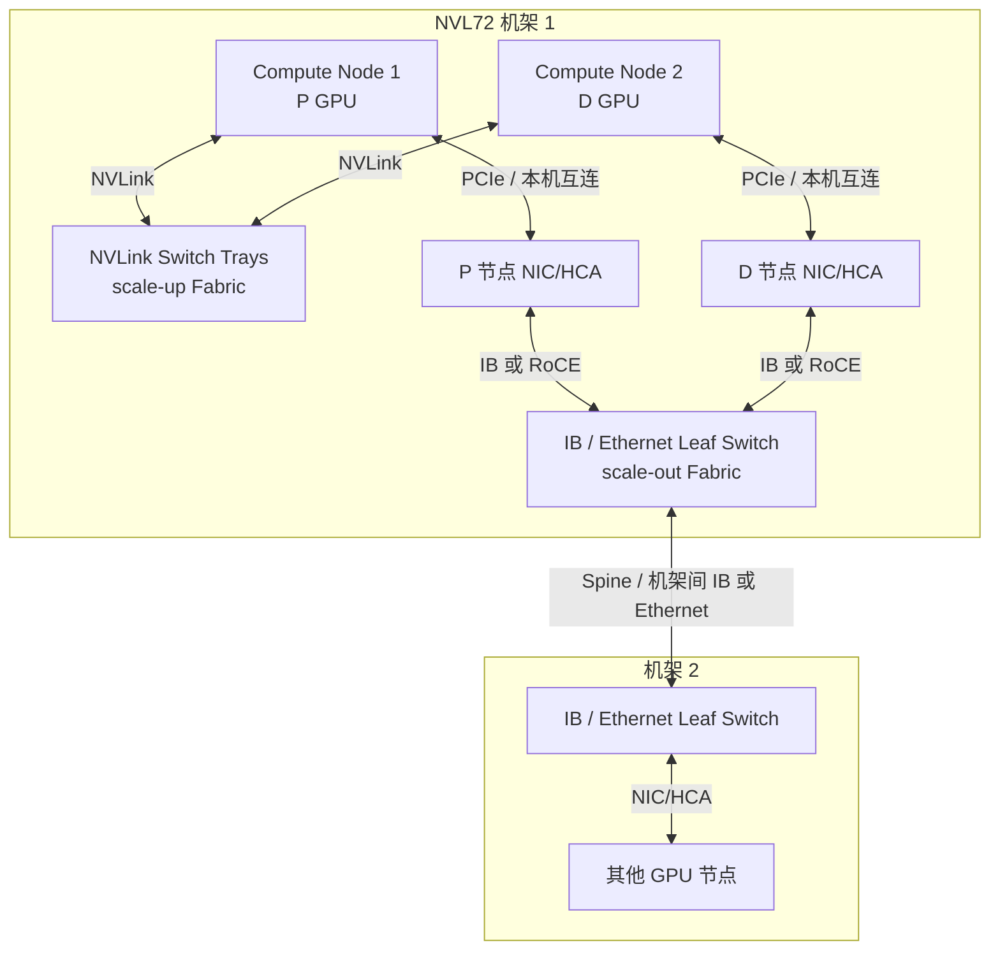

# NVL72：机架级 NVLink 系统

> 导航：[文档索引](<./00 索引：LLM推理基础设施知识地图.md>)

> **NVL72 是“72 个 GPU 组成一个机架级 NVLink 域”的系统形态，不是 GPU 型号，也不是所有 GPU 集群的通用配置。**

## NVL72 不等于某一代 GPU



```text
NVL = NVLink
72  = 一个 NVLink 域中有 72 个 GPU
```

GB200、GB300 和 Vera Rubin 都可以构成 NVL72。因此 NVL72 更像一种机架级 scale-up 架构，H100/B200/B300/Rubin 才是具体 GPU 代际/型号。

## 以 GB300 NVL72 为例



GB300 NVL72 中，18 个 compute tray 每个含 4 个 GPU，9 个 NVLink switch tray 将 72 个 GPU 组成高带宽 NVLink 域。机架中仍另有 Ethernet/InfiniBand 网络，用于对外 scale-out、存储和管理。

## 一个机架里可以同时有两套 Fabric



| Fabric | 连接什么 | 作用范围 | 用途 |
| --- | --- | --- | --- |
| **NVLink Fabric** | GPU 的 NVLink 端口 ↔ NVSwitch Tray ↔ GPU | 同一 NVL72 NVLink 域 | GPU memory access、collective、模型并行；跨 compute node 但仍在该 NVLink 域内 |
| **IB/Ethernet Fabric** | 节点 NIC/HCA ↔ Leaf/Spine Switch ↔ NIC/HCA | 同机架节点和跨机架节点 | scale-out、跨 NVLink 域、存储和其他网络通信 |

> **InfiniBand 和 GPUDirect RDMA 不是二选一。**InfiniBand（或 Ethernet + RoCE）提供网络 Fabric；GPUDirect RDMA 让这个网络中的 RNIC/HCA 直接读写 GPU 显存，避免 CPU 主存中转。

```text
普通机柜，同机柜不同节点 → IB/RoCE，可配 GPUDirect RDMA
不同机架的节点             → IB/RoCE，可配 GPUDirect RDMA
同一 NVL72 域内的 GPU         → 额外可用机架级 NVLink Fabric
```

物理上连入同一 NVLink 域不代表所有应用会自动使用该路径；跨 OS/跨 compute node 的 GPU memory sharing 还需要驱动、Fabric Manager/IMEX 和上层通信库支持。

## 它是不是 SOTA

> 状态截止：2026-08-23。“最新”会随产品路线变化。

- **GB300 NVL72**：已经有完整硬件、系统软件/固件和 Mission Control 支持，是当前可部署的顶级 Blackwell Ultra 机架系统。
- **Vera Rubin NVL72**：当前 NVIDIA 公布的新一代机架级架构，部分规格仍标注为 preliminary。
- **NVL72 形态**：从 Blackwell 继续到 Rubin，说明“72 GPU 机架级 NVLink 域”仍是 NVIDIA 顶级 scale-up 路线的核心形态。

```text
当前成熟顶级部署：GB300 NVL72
最新公布的下一代：Vera Rubin NVL72
```

## 它是不是通用配置

它不是普通 GPU 集群的主流最小单元：

- 需要整柜级供电、液冷、NVLink Fabric、网络和管理系统。
- GB300 NVL72 完整机架功率可达约 142 kW，远超普通机柜。
- 采购、部署、散热、固件升级和故障恢复复杂。
- 小模型或普通推理任务往往无法经济地利用 72 GPU 高速互联。

更常见的通用 GPU 集群单元仍是：

```text
1～8 GPU 节点
  → 多个节点通过 InfiniBand/RoCE 连接
  → 按需水平扩展
```

NVL72 主要面向超大模型训练、大规模 MoE、长上下文和高吞吐推理。它正在成为头部 AI 基础设施的重要参考形态，但不是像 PCIe/Ethernet 那样的行业通用标准。

## 与 PD 分离的关系

PD 分离不要求 NVL72。普通的多节点 GPU 集群就可以用 IB/RoCE + GPUDirect RDMA 在 P/D Worker 之间传输 KV Cache。

```text
普通 PD 分离：P GPU → RDMA 网络 → D GPU
NVL72 机架内：72 GPU 可利用机架级 NVLink Fabric
跨 NVL72 机架：仍需要 Ethernet/InfiniBand scale-out 网络
```

## NVIDIA 官方资料

- [DGX GB Rack Scale Systems User Guide](https://docs.nvidia.com/dgx/dgxgb200-user-guide/)：GB200/GB300 NVL72 硬件与软件栈。
- [DGX GB300 NVL72 Release Notes](https://docs.nvidia.com/dgx/dgxgb300nvl72-release-notes/overview.html)：GB300 NVL72 当前系统软件/固件发布状态。
- [NVIDIA Vera Rubin NVL72](https://www.nvidia.com/en-us/data-center/vera-rubin-nvl72/)：Rubin NVL72 当前公布的架构和 preliminary 规格。
- [NVIDIA NVL72 AI Factory Hardware](https://docs.nvidia.com/enterprise-reference-architectures/nvl72-ai-factory/latest/components.html)：GB300 NVL72 组成、NVSwitch、NIC/HCA、存储、供电和液冷。
